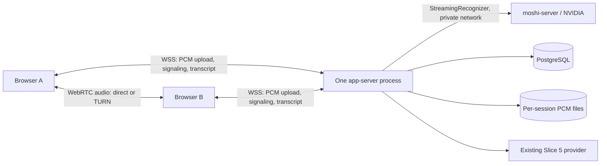

# Mosaïque — two-user voice and remote ASR architecture

**Date:** 2026-09-12

**Slice:** R0 — architecture and sequencing

**Status:** SPECIFIED; deployment review pending. No infrastructure or application feature implemented by this document.

**Inspection baseline:** `92f2219` (includes PR #18's `CODEX_HANDOFF.md`).

## 1. Objective and authority

The next milestone is a functional remote meeting between two people: they hear
each other through Mosaïque, each has a stable identity and independent microphone
stream, real streaming ASR transcribes both concurrently, and ending the meeting
produces persisted final segments plus the existing Slice 5 summary, decisions
and actions, reviewable by both participants.

The maintainer explicitly selected **Mosaïque carries audio**, **direct WebRTC
with TURN fallback**, **continue voice with a warning during ASR outages**, and
**Azure using the available $200 credit** during the architecture review on
2026-09-11. On 2026-09-12 the maintainer authorized implementation one slice and
one documented PR at a time. R0 ends at a documentation PR for review; it does
not authorize incidental provisioning or merging the PR automatically.

This amends D-01/ADR-01 and technical specification §1.2: companion-only operation
and the WebRTC exclusion no longer describe the next milestone. The PCM
WebSocket transcription ingress remains. It also supersedes the previous rule
that all remaining single-user work must precede GPU validation. Other contracts
and architectural boundaries remain in force unless a later PR explicitly
amends them. Historical documents and test evidence are not retroactively changed.

Inspected sources: repository runtime and deployment code, `PROJECT_STATE.md`,
`CODEX_HANDOFF.md`, `CLAUDE.md`, technical specification, implementation blueprint,
implementation plan, ADR-13, media-plane options (ADR-12), spike findings and tests.
The original PRD, original System Architecture & Design Blueprint and referenced
`realtime-meeting-product-engineering.md` were not found in the repository or
searched local document locations. Their summarized requirements in the
reconciliation blueprint are available; the originals were **not inspected**.
Standalone ADR files do not exist for most decisions; their table entries were
reviewed. The root `PROJECT_STATE.md`, not the older copy under `docs/`, is current.

## 2. Current runtime: implementation, not specification

Paths beginning with `frontend/` or `backend/` are relative to the repository
root; other module paths are relative to `backend/src/mosaique/`. Bare filenames
in a row share the preceding module directory unless otherwise qualified.

| Stage | Concrete files and behavior |
|---|---|
| Capture | `frontend/src/audio/capture.ts` obtains the local microphone; `frontend/public/audio-worklet.js` resamples device audio to 24 kHz mono s16 PCM, 1,920 samples / 80 ms per frame. |
| Browser transport | `frontend/src/realtime/client.ts`, `frames.ts`, `buffer.ts`: binary frames over `/api/ws/meetings/{id}`, reconnect and bounded offline buffering. Vite/nginx removes `/api`. |
| Gateway | `backend/src/mosaique/realtime/gateway/endpoint.py`: session-token authentication, meeting/participant lookup, frame/sequence validation, keepalive and ingress submission. `broadcaster.py` owns socket fan-out. |
| Ingress | `realtime/gateway/ingress.py`: `BrowserWebSocketIngress` queues neutral events defined by `realtime/ingress/interfaces.py`. |
| Runtime | `realtime/runtime_state.py`, `sessions/registry.py`, `sessions/meeting.py`, `sessions/participant.py`: process-local registry; independent participant queues, audio sessions, recognizer sessions and pump tasks. |
| Recognizer seam | `speech/interfaces/asr.py`: `StreamingRecognizer`, `ASRSession`, readiness, identity, health and neutral events. `asr_runtime/factory.py` selects the configured provider. |
| MLX | `speech/adapters/kyutai/session.py` wraps `mlx_runtime.py`; inference runs **inside the application process on a worker thread**, with cached weights and a process-wide single-session lock. No separate local MLX server exists. |
| Remote implementation | `asr_runtime/moshi_ws.py` opens the WebSocket and encodes MessagePack; `speech/adapters/kyutai/moshi_server.py` maps messages into ASR events behind `KyutaiBackend`. Implemented against test doubles; no real NVIDIA serving evidence. |
| Transcript | `transcript/segmenter.py` converts words/end-of-turn into interim and final events. `sessions/meeting.py` shifts stream-relative timestamps, broadcasts and persists finals. |
| Storage | `speech/audio/store.py` writes one PCM file per AudioSession, including silence padding. `persistence/repositories/transcript.py` stores finals with participant/sequence uniqueness. Model definitions and migrations are under `persistence/`. |
| End | `app/api/meetings.py` moves to FINALIZING, invokes registry drain, completes the meeting and enqueues a version-keyed intelligence job. `app/main.py` recovers stranded FINALIZING meetings. |
| Intelligence | `jobs/processor.py` runs in-process, polling PostgreSQL jobs with SKIP LOCKED. `intelligence/prompt.py`, `schema.py`, `adapters/openai_chat.py` and `llm_runtime/` build, call and validate evidence-linked outputs. |
| Review | `frontend/src/review/ReviewPage.tsx`, `paragraphs.ts`, `evidence.ts`, and `audio/playback.ts` read final segments/outputs and seek stored audio. Corrections remain additive through `transcript/corrections.py`. |

The app creates one recognizer session per participant stream; attribution is
endpoint identity, not mixed-audio diarization. Stream offsets are frame-derived.
The current runtime establishes the audio-session epoch while opening the stream
on join; the documented first-accepted-frame anchor must be checked against
staggered joins and slow ASR initialization. Client clocks must never determine
durable transcript ordering.

Current two-browser tests establish transcript fan-out on fake ASR. They do not
establish audible communication, real ASR concurrency, NAT traversal or remote
network performance. The existing review UI admits host tokens; participant-token
authorization exists in the backend but is not carried correctly into guest review.

## 3. Gap analysis

| Area | Reuse | Gap / required work |
|---|---|---|
| Media transport | PCM transcription WebSocket and worklet | No peer connection, signaling or remote playback. Add WebRTC voice and TURN; do not relay conversational PCM over TCP. |
| Participant/session handling | Durable participant IDs, audio sessions, reconnect grace, final-segment deduplication | Join retries/reloading an invite create new participants. Persist join identity, separate capture restart from socket resume, and guard replacement cleanup against an obsolete socket unregistering its successor. |
| ASR concurrency | Per-participant recognizer sessions | MLX deliberately rejects stream two. Validate independent Rust batch slots, release and reuse on real hardware. |
| GPU/runtime hosting | Existing remote adapter and config axis | No GPU image, pinned serving configuration, weight cache or deployment proof. |
| Networking | Same-origin API/WS proxy | HTTPS/WSS, origin checks, TURN, private app-to-ASR access and cross-network measurements absent. |
| Deployment | Compose, Dockerfiles and migrations | Backend Dockerfile omits `entrypoint.sh`; required ASR/LLM extras and synchronous migration driver are not installed by the default image. No audio volume or real runtime settings in Compose; DB/backend ports are publicly bindable. |
| Authentication | Signed tokens, hashed invites and tenant-scoped resource checks | Guest HTTP token use and host role presentation need correction. Authenticate signaling/TURN issuance; enforce origin, handshake, rate and participant limits. Audit create/list routes for host-only policy rather than assuming all existing routes enforce it. |
| Persistence | PostgreSQL, final-segment uniqueness, versioned outputs and DB jobs | Keep existing stores. Add retry-safe join identity and mounted disks. Verify simultaneous end calls, drain/persist ordering and restart recovery for jobs left running. |
| Frontend | Creation/join, live attribution, review and citations | Add audible call, mute/leave, distinct call/recording/transcription states, playback recovery, reload identity and guest review. Avoid unrelated presentation changes. |
| Observability | Logs, health endpoints, counters and timing samples | Remote readiness always returns unknown. Metrics are in-memory, some sample lists grow without bound, no exporter exists. First-word samples and cross-clock subtraction do not prove perceived per-utterance latency. |

Other concrete risks: ASR errors are only logged by `_dispatch`; opening an ASR
stream can interrupt the shared ingress consumer; failed ingress queue submissions
are ignored; sequential socket sends have no per-peer timeout; existing drain
timeouts do not form one shared end deadline. These are general lifecycle defects,
not reasons to put CUDA types in the runtime. Reproduce them in narrow tests
before changing behavior; describe findings separately from prior verified claims.

## 4. Transport decision and public interfaces

Capture the microphone once. Its local MediaStreamTrack feeds WebRTC and the
existing AudioWorklet. Remote tracks are playback-only; never connect them to
the transcription capture graph. Keep native WebRTC audio encoding independent
of the canonical 24 kHz ASR format.

**Direct WebRTC wins for two participants:** one peer connection, no server-side
media processing requirement, and existing authenticated signaling transport.
TURN is required to make cross-network connectivity testable. LiveKit would
provide room/SDK machinery but add a media service; its documented VM deployment
uses Compose and supports TURN/TLS. It is deferred because those capabilities
are not yet needed at this size, not because an SFU is incompatible with the
monolith. See sources S1–S3.

Minimum interface changes, owned by their respective implementation PRs:

- Add typed/versioned offer, answer and ICE-candidate messages to the existing
  WS protocol. Derive sender identity from the authenticated socket, validate
  that the target is an admitted participant in the same meeting, and reject
  stale connection generations. Deterministic negotiation roles and bounded ICE
  restart handle simultaneous reconnects.
- Add an authenticated meeting-scoped ICE configuration endpoint returning
  expiring TURN credentials. The shared TURN secret never reaches a browser.
- Add an optional join idempotency nonce to the request and a nullable,
  meeting-scoped unique field in persistence. A retry with the same valid invite
  and nonce returns the same participant. The nonce alone is not authentication.
- Keep participant credentials in session storage, keyed by meeting. Use them
  for guest reads and reconnect hydration; retain host credentials for host-only
  actions. Show host controls from authorized meeting context, not merely the
  presence of any host token in local storage.
- Add a capture-generation identifier to hello. The same capture reconnects
  with sequence continuity; reload starts a new AudioSession under the same
  participant. An obsolete socket cannot publish leave or remove the new socket.
- Add a bounded end-of-input handshake so both clients flush their final partial
  worklet frame, report their last sequence, and stop sending at host end. Late
  or absent acknowledgements consume one shared finalization deadline rather
  than holding the meeting open indefinitely.
- Preserve existing transcript IDs, final/interim semantics and canonical PCM.
  Regenerate OpenAPI/typed clients when HTTP contracts change. Keep signaling
  types on the transport side of the ingress seam.

Mute controls outgoing voice and transcription capture together, leaving remote
playback active. Leave tears down that participant's resources without ending
the meeting. Host end tears down both calls and opens review for both users.
Autoplay failure offers an explicit playback action. Call, capture, recording
and transcription states are distinct: a working call does not imply working ASR.

Creation requires ready dependencies. An existing meeting may be joined during
an ASR outage with an explicit warning. Voice continues; audio is called recorded
only while it is reaching writable storage. Recovery starts a fresh inference
stream with correct offsets and a visible gap for unavailable transcription.
No automatic offline retranscription or silent fallback to fake ASR is added.

## 5. Azure topology, security and operating cost

One resource group and VNet in **West Europe**, subject to subscription quota and
SKU availability. Use Bicep for resources/NSGs and separate Compose definitions
for the app and GPU. No Kubernetes, Redis, Kafka or managed worker platform.

| Component | Initial deployment |
|---|---|
| App host | Ubuntu LTS `Standard_B2s`; TLS proxy, existing nginx frontend, **one** backend process, PostgreSQL 16 and coturn containers. Watch CPU credits under sustained load. |
| PostgreSQL | Existing version 16 container; persistent managed data disk, separate mounted directory. No public DB listener. |
| Audio | Existing LocalAudioStore on that data disk, explicitly mounted and writable by the backend UID. Never container-layer or temporary-disk storage. |
| GPU host | Ubuntu LTS `Standard_NC4as_T4_v3`, one T4 / 16 GB VRAM; isolated moshi-server container and persistent model cache. Hardware fit is unverified. |
| LLM | Existing OpenAI-compatible Slice 5 provider/configuration; no Azure-specific LLM migration. Credit eligibility for this external provider is not assumed. |
| Secrets | Protected untracked deployment files mounted/injected at runtime; separate signing, DB, ASR and TURN secrets. No default development secrets in deployment. Key Vault/managed identity is a pilot option. |

Two hosts let review and durable state remain available while the GPU is off.
One GPU VM hosting everything is technically smaller, but ties ordinary product
availability to paid GPU uptime. Do not add object storage for this validation:
AudioStore currently returns synchronous BinaryIO handles; a Blob implementation
would need an explicit staging/upload lifecycle rather than a URL substitution.

Network rules:

- Public app: HTTPS/WSS 443; HTTP 80 only for redirects/certificate issuance.
  Same-origin `/api` routing, SPA routes and the worklet asset must work through TLS.
- TURN: authenticated UDP/TCP 3478, TLS 5349 and a bounded UDP relay range.
  Configure the public/private IP mapping, expiring credentials, allocation
  quotas and deny relay access to private/loopback/link-local destinations,
  including cloud metadata. Test forced relay, not just direct connectivity.
- Networks permitting only TLS 443 may need a later dedicated TURN public IP
  and 443 listener. Do not claim universal corporate-firewall compatibility.
- Keep backend 8000 and PostgreSQL private to Compose. Bind ASR to the GPU's
  private interface; permit its port only from the app host. Authenticate the
  backend using `kyutai-api-key` over this isolated VNet path.
- Supply explicit GPU outbound access for image/model downloads. A public IP
  may provide egress while inbound NSG rules deny public traffic; it must not
  expose ASR. SSH to GPU uses the private address through the app host; public
  administration is restricted to the operator's address.
- TLS certificates must renew for both web and TURN endpoints; protect shared
  key material. DNS is a deployment parameter to resolve before provisioning.
- Enforce WebSocket origin and hello timeout, payload/rate limits, one active
  meeting and two participant slots initially. Returning participants reuse
  their slot. Do not route existing call/review traffic away when ASR readiness
  fails: ASR readiness gates new meeting creation; an existing meeting can still
  admit its second participant with a warning. Liveness governs process restart.
- Redact credentials, invite query strings, SDP/ICE and model payloads from logs.
  Health detail and metrics are operator surfaces, not public diagnostic dumps.

Public Linux retail rates fetched from Azure's API on 2026-09-11 (S7): B2s
**$0.048/hour**, NC4as_T4_v3 **$0.658/hour**. Both continuously for 720 hours cost
**$508.32 compute only**. An app VM for 720 hours plus 40 GPU hours costs
**$60.88 compute only**. Disks, IPs, egress, backup and external LLM charges are
additional. These are retail estimates, not a bill or proof of credit coverage.

Use persistent serving during scheduled validation windows: boot, warm weights,
verify readiness, then admit participants. No Spot, serverless cold starts or
automatic per-request GPU lifecycle. Deallocate after validation with no active
meeting; merely stopping the OS does not stop allocated VM billing. Retain model
cache and data disks; their charges continue (S8). Set budget alerts and record
remaining credit before each validation window; alerts are not a hard spending cap.

**Subscription gate:** the maintainer described a $200 free trial, but the active
CLI account reported `Microsoft Azure Sponsorship` / Enabled. West Europe quota
queries returned empty lists, not confirmed zero quotas or confirmed eligibility.
Resolve the intended subscription, balance/expiry, Compute availability, GPU-family
quota and regional SKU availability before allocating anything. Free trials cannot
request quota increases (S9). Do not upgrade billing or switch providers silently.

## 6. GPU runtime and MLX migration

Use a pinned Rust/CUDA build with upstream **BatchedAsr**, STT-1B en/fr and
`stt-1b-en_fr-candle` artifacts. Start at **batch size 2**, not the upstream
example's 64. Pin source/image/model revisions and configuration checksums before
the first hardware run; include them in every report. Resolve artifact downloads
to cached local paths so restarts do not silently pick up changed weights (S4).

T4 starts with an explicit **F16 language-model dtype override**, not the current
application default label BF16; retain the runtime's F32 Mimi path. Upstream has
a dtype override and T4 provides FP16 acceleration (S5–S6). This is a candidate
configuration, **not a tested compatibility or capacity claim**. Prove compilation,
kernels, numerical output and 2-stream throughput before adopting it. If it fails,
report the bottleneck and revised GPU cost for review rather than automatically
buying a larger card. Do not extrapolate H100/L40S vendor concurrency figures.

Protocol corrections to verify against the pinned server (S5):

- Wait for server `Ready`; distinguish capacity exhaustion from transport failure.
- Pin the semantic VAD head interpretation; the current last-element heuristic
  is not a verified end-of-turn policy. Validate delay/progress accounting with
  staggered streams rather than treating global batch progress as a stream clock.
- Flush with a matching marker and bounded trailing silence, deliver pending
  words, and surface timeout. Upstream's own file path adds silence after a
  marker; the existing marker-only implementation does not prove tail completion.
- Readiness checks an idle slot using actual progress, with bounded waits and
  caching. While occupied, use observed active-session health and tracked
  capacity; do not open a third probe stream on a two-slot server.
- Reader failure, send failure and close release resources. Reconnecting a
  socket creates fresh inference state; never silently reuse the old offset.
- Keep inference payload logging disabled and verify disk output during tests.
  Record actual precision in `Meeting.asr_version` and full provenance in reports.

Strengthen neutral lifecycle behavior without Kyutai imports: membership and
recording must survive recognizer opening/processing failure; status and gaps
must reflect that failure. Recover in a fresh audio/inference session retaining
participant identity. Fix ignored ingress rejection and bounded peer writes.
Unify finalization under a shared deadline and verify final persistence before
completion. Recover stranded running jobs with the existing PostgreSQL worker.
Each defect needs named regression evidence, not an inference presented as fact.

| Development mode | Configuration and boundary |
|---|---|
| Automated tests / portable development | `MOSAIQUE_ASR_RUNTIME=fake`; no model dependency required. |
| Apple silicon, one real stream | Native app process with `MOSAIQUE_ASR_RUNTIME=mlx`; MLX worker thread, outside Docker/Metal limitations. |
| Local app with real concurrent ASR | `moshi_server` via an operator SSH tunnel to private ASR. |
| Cloud | `moshi_server` via private VNet address, API key and actual precision setting. |

After adapter corrections, provider selection remains configuration-only.
`MeetingIngress`, `StreamingRecognizer` and `KyutaiBackend` remain the seams.
Runtime-independent error handling fixes are not permission to introduce model
types upstream. Keep architectural tests and MLX behavior intact. Raw ASR text,
word timings and additive corrections are preserved. L-28 remains deferred;
segmentation is measured on CUDA before any related retuning proposal.

## 7. Slice-by-slice PR sequence

**One slice → one documented PR → maintainer review/merge → next slice.** Use
`codex/` branches. Never bundle the next slice to make a PR seem complete. If a
gate cannot run, name the blocker and leave verification open. Infrastructure
changes are reviewed as concrete configuration before resource allocation.

| Slice / proposed PR title | Deliverable | Exit gate |
|---|---|---|
| **R0 — Specify two-user voice and Azure ASR deployment** | This document, state/priority update, explicit supersession pointers and PR workflow. Documentation only. | Links, source paths, scope and diff checked; reviewed before proceeding. |
| **R1 — Define reproducible Azure and Rust ASR deployment** | Bicep, GPU Docker/Compose configuration, pinned versions, private network/security rules, cost/quota checklist and runbook. | Configuration validates; intended subscription, quota and priced deployment recorded. If unavailable, mark hardware blocked rather than verified. Review before provisioning. |
| **R2 — Validate two independent Rust ASR streams** | Adapter readiness, capacity handling, VAD mapping, tail flush and connection-state fixes; one/two-stream GPU probe and reports. | Narrow protocol tests plus real fixture at 1x, tails intact, two independent streams, slot release/reuse, runtime provenance. |
| **R3 — Keep recording and lifecycle correct during ASR failure** | Neutral failure isolation, truthful status/gaps, bounded ingress/fan-out, shared finalization and stranded-job recovery. | Fake failure matrix, simultaneous end/persistence tests and real ASR interruption; voice integration is still later. |
| **R4 — Preserve participant identity and guest review** | Join idempotency migration, capture generations, replacement ownership, guest HTTP credentials and host authorization. | Retry/reload/reconnect do not duplicate participants; guest review/hydration work; cross-tenant and host-only cases fail closed. |
| **R5 — Carry two-person voice over WebRTC** | Shared capture, authenticated signaling/ICE credentials, peer playback, TURN configuration, mute/leave/end. | Two-context fake-ASR call tests, stale signaling/replacement tests and forced TURN; no real ASR concurrency claim from browser fakes. |
| **R6 — Deploy and observe the complete two-user path** | App image/Compose repairs, mounted storage, TLS, limits, real provider config, bounded metrics and rollout runbook. | Clean image starts/migrates; storage survives recreation; auth/origin/admission probes and full deployed smoke pass. |
| **R7 — Verify the remote meeting acceptance gate** | Cross-network 30-minute reports, fault runs, review evidence and measured-value/state updates. Fix only defects demonstrated by this gate. | All §8 criteria pass with actual runtime named; review/merge closes the milestone. |

Each PR description must stand alone: concrete problem and resulting behavior;
scope and API/schema/config changes; exact test commands/results and environment;
unverified gates; risks; migration/rollback steps; and the next slice. Lead with
what a reviewer can observe, not conversation history. Update PROJECT_STATE at
each gate without replacing old measured evidence. Documentation-only PRs need
documentation checks, not a fabricated application-test rerun.

Deployment rollback uses prior pinned images/configuration. Back up DB/audio
before migrations. Deploy with no active meetings for validation; graceful drain
is a safeguard, not a zero-downtime guarantee. Configure container stop grace to
exceed the bounded application drain. Do not add a second Uvicorn worker: registry,
sockets and in-flight sessions are process-local.

## 8. Exact acceptance protocol and measurements

Run a **30-minute** audio-only meeting on two physical desktop devices, separate
browser sessions and separate networks (home broadband and mobile hotspot).
Use headphones, consenting test participants and current desktop Chromium.
No external call service may carry their conversation.

1. A creates; B follows the invite. Record exactly two distinct participant IDs.
2. Confirm both people hear one another inside Mosaïque; capture inbound/outbound
   WebRTC stats. Audible playback is required, not just an established connection.
3. Alternate prepared French passages with distinct speaker phrases, include
   overlapping speech and pauses, and state a decision and assigned action with
   a deadline. Keep reference transcripts for the prepared passages.
4. Confirm two concurrently progressing real ASR sessions and distinct PCM
   recordings. Both browsers converge on the same attributed final segments.
5. Mute/unmute each participant; outgoing voice and ASR capture stop together,
   while the muted participant can still hear the other person.
6. Interrupt B's network for ten seconds. Recover under the same participant ID
   without duplicate final segments. Characterize bounded buffer drops separately.
7. Reload B and retry a join request. Reuse participant identity with a fresh
   capture session. Test simultaneous/replaced sockets separately.
8. End during a final sentence. Both calls/captures stop, final words persist,
   all stream resources close, and the meeting reaches COMPLETED.
9. Send concurrent/repeated end requests: one transcript version and one job for
   that version. Confirm both users can review without sharing a host token.
10. Target outputs within **90 seconds** of end. Validate summary, decision/action
    evidence IDs against stored segments and click a citation to the correct audio.
11. Restart/recreate the app container after completion; transcript, outputs and
    audio survive. A second meeting must not inherit the first meeting's state.

Keep a healthy-run measurement separate from fault runs (steps 6–7 and intentional
outages). Also test forced TURN; UDP-blocked TURN/TLS; ASR stop/restart while voice
continues; denied microphone/autoplay; invalid/expired tokens; cross-meeting
signaling; third-participant admission; disallowed WS origins; unauthorized TURN;
restart during FINALIZING; and restart during an intelligence job.

| Measure | Acceptance / evidence |
|---|---|
| First-word latency | Existing p95 target ≤2.0 s; measure utterance/audio onset to visible first text through a common-clock fixture/browser path. Backend-only timing is reported separately. |
| Final-segment latency | Existing p95 target ≤3.5 s from reference speech end to final event; not a gateway-to-word proxy. |
| Frame loss | Existing <2% target over the healthy 30-minute run. Report expected/emitted, gateway accepted, missing, rejected, ingress dropped and ASR skipped separately per participant; declare denominators. |
| Attribution | Distinct prepared phrases remain with the correct speaker during alternating and overlapping speech. Report WER per reference passage and inspect boundaries; no guessed CUDA WER threshold. |
| Identity / duplicates | No extra participant from reload/retry; no duplicate persisted participant/segment-sequence key. Additional legitimate AudioSessions are expected after a capture restart. |
| GPU | Memory at warm baseline/load/after release, real-time throughput, processing lag, slot reuse and repeated-meeting stability. Sustained streams must keep up without growing backlog. |
| Voice | Human bidirectional playback confirmation plus candidate type, RTT, jitter, loss, audio energy and reconnect duration from getStats. Do not infer one-way mouth-to-ear latency from RTT alone. |
| Lifecycle | Drain duration/timeouts, final-tail presence, one job per version, provider/job duration and evidence validation. Show failures distinctly from extracted-nothing outputs. |

Replace unbounded in-process sample accumulation with bounded histograms or
bounded report reservoirs. Expose required metrics to operators; avoid participant
IDs as unbounded Prometheus labels. Keep correlation IDs in sanitized logs. Fix
or exclude the invalid capture/server clock subtraction; durable ordering remains
server-anchor plus stream frames. Include clock uncertainty in any cross-device
latency estimate and never equate it with a common-clock measurement.

Save fixture hashes/reference text, app/server/model revisions, image/config
digests, actual precision, device/network details, sanitized logs, browser/GPU
metrics and JSON reports. Real-model evidence must be labeled separately from
fake tests and historical MLX reports. Extend the existing architecture, adapter,
reconnect, lifecycle, persistence and Playwright suites instead of replacing them.

## 9. Two-to-four path and production boundary

| Stage | Included / deferred |
|---|---|
| Two-user validation | One active meeting, two participant slots; WebRTC/TURN voice; two real ASR streams; stable identity; guest review; TLS/auth limits; durable volumes; observable failure and repeatable deployment. |
| Four participants | Six peer connections total / three outgoing copies per browser; four independent PCM uploads; batch size four. Repeat the original 30-minute gate, <2% loss and latency budgets before increasing admission limits. Measure uplink, CPU, TURN traffic and GPU memory. |
| Pilot | Confirm consent, retention/deletion and residency; stronger host login; backup/restore drills; CI and dependency/container checks; alerts and incident/rollback runbook; spending controls. Consider managed PostgreSQL and Blob only for an actual availability/operations requirement. |
| Deferred platform work | Kubernetes, Kafka, Redis, distributed job workers, horizontal app replicas, autoscaling GPU pools, vector stores, platform bots and SFU-based transcription ingestion. |

Four-user audio mesh is a hypothesis to validate, not a promised production
capacity. Adopt LiveKit/SFU when mesh fails browser/uplink/network gates or the
product needs larger rooms, video, server-side media processing or per-listener
translation. It can replace voice first while PCM transcription stays unchanged;
moving ASR ingress behind MeetingIngress is a separate reviewed change.

Main remaining risks: unproven T4/kernel/precision compatibility and capacity;
Azure eligibility; genuine remote protocol/tail/reconnect behavior; echo leakage;
WebRTC/TURN firewall coverage; current runtime races and false recording status;
unmeasured CUDA segmentation; and one VM as the app/DB failure domain. Keep
L-28 and other unrelated presentation debt deferred. No customer-data pilot is
implied by an internal test passing; existing Q2/Q3/A-11 decisions stay open.

## 10. Evidence from the planning pass

Executed on 2026-09-11 against `92f2219`:

| Check | Result and limit |
|---|---|
| `cd backend && uv run --no-sync pytest -q -m 'not integration and not slow'` | **305 passed, 94 deselected**. No database integration or real GPU run. |
| `cd frontend && npm test -- --cache=false` | **91 passed**, 9 files; unit tests, not browser calls. |
| `cd frontend && npm run typecheck` | Passed. |
| Azure account / West Europe usage reads | Active subscription name Sponsorship, Enabled; quota lists empty. No cloud resources changed. |
| Azure public retail API | Linux consumption rates in §5 retrieved; actual subscription balance/coverage not verified. |

These results are inherited evidence from the planning pass, not reruns caused by
this documentation change. No real NVIDIA, cross-network, browser-call or database
integration acceptance is claimed. R0's own documentation checks are recorded in
the PR. Existing local node_modules/build-state changes and `scripts/` are outside R0.

## 11. External sources

Inspected 2026-09-11. Pin and recheck upstream versions during R1/R2; `main` URLs
identify reviewed code, not immutable deployment pins.

- **S1:** [WebRTC peer connections and signaling](https://webrtc.org/getting-started/peer-connections-advanced).
- **S2:** [LiveKit VM deployment](https://docs.livekit.io/transport/self-hosting/vm/).
- **S3:** [coturn configuration reference](https://github.com/coturn/coturn/blob/master/examples/etc/turnserver.conf).
- **S4:** [Kyutai Rust STT configuration](https://github.com/kyutai-labs/delayed-streams-modeling/blob/main/configs/config-stt-en_fr-hf.toml).
- **S5:** [Batched ASR serving implementation](https://github.com/kyutai-labs/moshi/blob/main/rust/moshi-server/src/batched_asr.rs), [dtype selection](https://github.com/kyutai-labs/moshi/blob/main/rust/moshi-server/src/utils.rs), [server CUDA feature](https://github.com/kyutai-labs/moshi/blob/main/rust/moshi-server/Cargo.toml).
- **S6:** [Azure NCasT4_v3 specifications](https://learn.microsoft.com/en-us/azure/virtual-machines/sizes/gpu-accelerated/ncast4v3-series), [NVIDIA T4 precision](https://www.nvidia.com/en-us/data-center/tesla-t4/).
- **S7:** [Azure retail pricing API](https://prices.azure.com/api/retail/prices). Filters: `armRegionName eq 'westeurope'`, `priceType eq 'Consumption'`, and `armSkuName` of `Standard_B2s` or `Standard_NC4as_T4_v3`; select Linux regular consumption, excluding Windows, Spot and Low Priority.
- **S8:** [Azure VM power states and billing](https://learn.microsoft.com/en-us/azure/virtual-machines/states-billing).
- **S9:** [Azure subscription quota policy](https://learn.microsoft.com/en-us/azure/azure-resource-manager/management/azure-subscription-service-limits#how-to-manage-limits).
