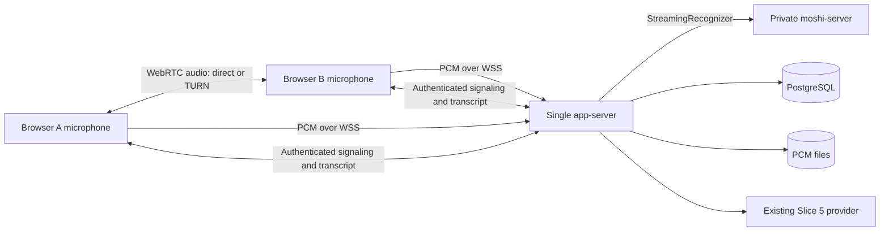

# Mosaïque: two-person voice meeting with remote Kyutai ASR

## 1. Decision and verified baseline

**Build an audio-only call inside Mosaïque using direct WebRTC with TURN fallback. Keep the existing WebSocket transcription pipeline and modular monolith. Deploy one small Azure application VM and one separately managed NVIDIA GPU VM.**

This incorporates your decisions:

- Mosaïque carries participant audio.
- Direct WebRTC is preferred over LiveKit for this milestone.
- Voice continues during an ASR outage, with an explicit transcription warning.
- Azure is the preferred host, using the available $200 credit.
- Further single-user presentation work is deferred.

This changes the previously accepted companion-only decision, D-01/ADR-01. It does **not** require replacing `MeetingIngress`, `StreamingRecognizer`, PostgreSQL, or Slice 5.

**Inspection baseline:** repository at `92f2219`, including the newly pulled `CODEX_HANDOFF.md`. The original PRD, original System Architecture document, and referenced engineering skill were not found; their requirements are available only through the repository’s reconciliation documents. Do not claim those originals were inspected.

**Checks executed during this pass:**

- Backend: `305 passed, 94 deselected` with integration and slow tests excluded.
- Frontend: `91 passed`.
- Frontend typecheck: passed.

No real GPU, browser call, cross-network meeting, or database integration run was performed. Existing modifications in the working tree were preserved.

**Plan-mode limitation:** this proposal has not been written to disk. The first implementation action is documentation only, described in §8; application changes and provisioning follow deployment review.

## 2. Current runtime and exact gaps

### Current runtime path

| Stage | Concrete implementation |
|---|---|
| Microphone capture | [capture.ts](/Users/mac/isaac/frontend/src/audio/capture.ts) obtains the microphone; [audio-worklet.js](/Users/mac/isaac/frontend/public/audio-worklet.js) resamples device audio to 24 kHz mono PCM and emits 80 ms frames. |
| Browser transport | [client.ts](/Users/mac/isaac/frontend/src/realtime/client.ts) sends framed PCM over the same-origin `/api/ws/meetings/{id}` connection, with reconnect buffering. Vite or nginx strips `/api`. |
| Gateway | [endpoint.py](/Users/mac/isaac/backend/src/mosaique/realtime/gateway/endpoint.py) validates the session token, binds participant identity, checks frames and sequences, and submits ingress events. |
| Ingress and runtime | [ingress.py](/Users/mac/isaac/backend/src/mosaique/realtime/gateway/ingress.py) queues events. [registry.py](/Users/mac/isaac/backend/src/mosaique/realtime/sessions/registry.py) owns process-local meeting runtimes. |
| Per-participant processing | [meeting.py](/Users/mac/isaac/backend/src/mosaique/realtime/sessions/meeting.py) creates independent streams, records arriving audio, and runs participant pumps. [participant.py](/Users/mac/isaac/backend/src/mosaique/realtime/sessions/participant.py) owns bounded queues and frame-derived stream time. |
| Recognizer selection | [factory.py](/Users/mac/isaac/backend/src/mosaique/asr_runtime/factory.py) supplies a `StreamingRecognizer`. `KyutaiRecognizer` and `KyutaiSession` wrap the selected `KyutaiBackend`. |
| Current real ASR | [mlx_runtime.py](/Users/mac/isaac/backend/src/mosaique/speech/adapters/kyutai/mlx_runtime.py) runs MLX **inside the backend process on a worker thread**, with cached weights and a lock allowing only one active stream. |
| Planned remote ASR path already present | [moshi_ws.py](/Users/mac/isaac/backend/src/mosaique/asr_runtime/moshi_ws.py) carries MessagePack over WebSocket; [moshi_server.py](/Users/mac/isaac/backend/src/mosaique/speech/adapters/kyutai/moshi_server.py) translates the server protocol into neutral ASR events. This path remains unverified against a real server. |
| Transcript | [segmenter.py](/Users/mac/isaac/backend/src/mosaique/transcript/segmenter.py) turns word/end-of-turn events into interim and final segments. The runtime broadcasts updates and persists finals. |
| Persistence | [transcript.py](/Users/mac/isaac/backend/src/mosaique/persistence/repositories/transcript.py) stores segments with participant/sequence uniqueness; [store.py](/Users/mac/isaac/backend/src/mosaique/speech/audio/store.py) writes one PCM file per audio session. |
| Finalization and intelligence | [meetings.py](/Users/mac/isaac/backend/src/mosaique/app/api/meetings.py) handles end → drain → completion → job enqueue. [processor.py](/Users/mac/isaac/backend/src/mosaique/jobs/processor.py) runs the existing Slice 5 provider, validates evidence IDs, and stores versioned outputs. |
| Review | [ReviewPage.tsx](/Users/mac/isaac/frontend/src/review/ReviewPage.tsx) reads transcript and outputs, presents grouped paragraphs, and resolves citations to stored audio. |

### Two-user gap analysis

| Area | Existing capability | Required action |
|---|---|---|
| Media transport | Independent microphone uploads and transcript broadcasts exist. There is no live remote-audio playback or peer negotiation. | Add WebRTC voice, authenticated signaling, remote playback and TURN. |
| Participant/session handling | Durable participants, per-stream sessions, reconnect grace and transcript deduplication exist. | Preserve identity through reload and join retries. Distinguish a restarted capture from a resumed socket. Fix socket replacement cleanup: the old socket currently unregisters by participant ID and can remove its replacement. |
| ASR concurrency | The runtime creates independent recognizer sessions. MLX explicitly refuses a second stream. | Use remote Rust serving; validate isolation, slot reuse and concurrent progress. |
| GPU hosting | No reproducible GPU deployment exists. | Add a pinned CUDA/Rust image, model configuration and persistent model cache. |
| Networking | Same-origin proxying and WebSocket support exist; all recorded tests are local. | Add HTTPS/WSS, ICE/TURN, private backend-to-ASR access and cross-network validation. |
| Deployment | Compose contains PostgreSQL, backend and frontend. | Repair packaging: copy the entrypoint, install the ASR/LLM extras and migration driver, mount durable audio, supply real provider configuration and remove public database/backend ports. |
| Authentication | Signed host/session tokens, hashed invites and tenant-scoped backend reads exist. | Carry participant credentials into reconnect hydration and guest review. Authenticate signaling and TURN credential issuance. Add origin checks, handshake limits and admission limits. |
| Persistence | PostgreSQL already stores final segments, participants, outputs and jobs. | Keep it. Add join idempotency and mounted storage; verify finalization under simultaneous input and duplicate end requests. |
| Frontend | Creation, joining, attributed transcript and host review exist. | Add call status, remote audio, mute/leave, playback recovery and guest review. Current guest review falls through to the host-token gate. |
| Observability | Structured logs, health endpoints, counters and timing samples exist. | Implement remote readiness and bounded metric export. Existing first-word samples do not establish per-utterance latency; cross-machine clock subtraction is unsuitable for end-to-end claims. |

Two further reliability gaps matter for this milestone:

- ASR errors are currently logged by the meeting runtime; this does not reliably implement the promised “voice and recording continue, transcription unavailable” behavior.
- Finalization uses different timeout layers and does not establish a shared stop boundary across both browsers. A real tail-drain test is required before claiming all final words are persisted.

## 3. Transport and interface design

### Voice and transcription use separate paths

Capture each microphone once. Feed its local track to WebRTC and the existing AudioWorklet. Remote tracks are playback-only and never enter the transcription capture graph.

WebRTC supplies the voice transport; the application must exchange offers, answers and ICE candidates through signaling. The existing authenticated gateway can perform that exchange without introducing another application service. [WebRTC peer connection documentation](https://webrtc.org/getting-started/peer-connections-advanced)

**Why no LiveKit now:** two audio participants need one peer connection. There is no current requirement for server-side media processing, video, recording an SFU output, or large rooms. LiveKit would reduce custom media-room work but add a media server and deployment configuration. It remains a credible future option; its documented VM deployment supports Compose and TURN/TLS. [LiveKit VM deployment](https://docs.livekit.io/transport/self-hosting/vm/)

### Minimum interface changes

- Add typed, versioned signaling messages to the existing WebSocket protocol. The gateway derives the sender from authentication and permits delivery only to the other admitted participant in the same meeting.
- Include connection generations so delayed messages from replaced connections are rejected. Use deterministic negotiation roles and bounded ICE restart/retry behavior.
- Add an authenticated, meeting-scoped ICE-configuration endpoint issuing expiring TURN credentials. Never send the TURN shared secret to browsers.
- Add a join idempotency nonce, persisted with a meeting-scoped uniqueness constraint. Repeated requests with the same valid invite and nonce return the same participant.
- Store the joined participant session in browser session storage. Guest HTTP requests use the participant token; host-only controls retain host authorization.
- Identify capture generations in the handshake: reconnecting the same capture preserves its sequence; reloading starts a fresh audio session under the existing participant.
- Keep existing transcript events, canonical PCM and `StreamingRecognizer` vendor-neutral.

### User-visible behavior

- Both participants hear each other through Mosaïque.
- Mute disables outgoing voice and transcription capture together; listening continues.
- Leave releases local capture, peer connections and sockets. It does not end the other participant’s meeting.
- Host end stops both clients, drains accepted audio, closes the call and opens review for both participants.
- Call connection, microphone capture, recording and transcription have separate status indicators.
- An ASR outage does not terminate voice. Recording continues only where audio is actually reaching writable storage; the UI must not claim otherwise.
- Creating a meeting requires ready dependencies. Joining an existing meeting during an ASR outage remains possible with the warning you selected.

Initial supported conditions: two consenting participants, headphones, desktop Chromium, audio only. Speakerphone echo and other browsers are characterization work, not implied acceptance.

## 4. Azure deployment and GPU design

### Smallest practical topology

Use one resource group and VNet in **West Europe**, subject to quota and availability.

| Component | Initial choice |
|---|---|
| Application host | Ubuntu LTS `Standard_B2s`, running Compose: TLS proxy, existing frontend nginx, one backend process, PostgreSQL 16 and coturn. |
| GPU host | Ubuntu LTS `Standard_NC4as_T4_v3`: one NVIDIA T4 with 16 GB VRAM. Run only the isolated ASR runtime and its operational support. |
| Database | PostgreSQL container on the app VM, with data on a persistent managed disk. |
| Audio | Existing `LocalAudioStore` on the app VM’s persistent data disk. Keep database and audio mount paths explicit. |
| ASR cache | Persistent GPU-host disk for pinned weights and tokenizer files. |
| Intelligence | Existing OpenAI-compatible Slice 5 configuration. Azure hosting does not require changing the provider. |
| Deployment description | Bicep for Azure resources and networking; separate app/GPU Compose definitions with pinned images. |

The T4 VM’s hardware specification is documented by Azure, but its ability to meet Mosaïque’s latency targets is **a measurement gate**, not a vendor-backed performance claim. [Azure NCasT4_v3 specifications](https://learn.microsoft.com/en-us/azure/virtual-machines/sizes/gpu-accelerated/ncast4v3-series)

Separate hosts allow review and persistence to remain available while the GPU is deallocated. A single GPU VM could technically host everything, but would tie ordinary application availability to expensive GPU uptime.

### GPU configuration

- Use Rust `moshi-server` with CUDA and the upstream **BatchedAsr** configuration for STT-1B en/fr.
- Start with **batch size 2**, not the upstream example’s 64.
- Use the Rust-compatible `stt-1b-en_fr-candle` artifacts while preserving the logical model identity `kyutai/stt-1b-en_fr`.
- Pin the server revision, model revisions, image digest and configuration checksum.
- On T4, start with an explicit **F16 language-model dtype override** and the runtime’s F32 Mimi path. Do not label it BF16. Validate compilation, kernels, numerical output and real-time performance before adoption.
- Keep model payload logging disabled and verify that the runtime does not create an unintended second audio/transcript archive.

The upstream configuration supplies the model artifacts, batching and delay settings. The Rust runtime supports a dtype override; T4’s documented accelerated floating-point path is FP16. [Kyutai configuration](https://raw.githubusercontent.com/kyutai-labs/delayed-streams-modeling/main/configs/config-stt-en_fr-hf.toml), [runtime dtype selection](https://raw.githubusercontent.com/kyutai-labs/moshi/main/rust/moshi-server/src/utils.rs), [NVIDIA T4](https://www.nvidia.com/en-us/data-center/tesla-t4/)

If T4 fails the two-stream gate, stop and report the measured bottleneck. A larger GPU is a revised cost decision, not an automatic fallback.

### Network and security boundary

- Public app ingress: HTTPS/WSS on 443; port 80 only for redirect/certificate issuance.
- coturn: authenticated TURN on UDP/TCP 3478 and TLS 5349, with a bounded relay-port range and allocation quotas.
- Document that networks permitting only TLS 443 may require a later dedicated TURN IP/listener.
- Expose neither PostgreSQL nor backend port 8000 publicly.
- Bind ASR to the GPU’s private interface; allow its port only from the application host.
- Use the Kyutai API-key header in addition to network isolation.
- Provide explicit GPU outbound access for image/model retrieval. A GPU public IP may provide egress while its inbound NSG denies public access; the ASR listener remains private.
- Restrict administration to the operator’s address and private SSH through the app host.
- Store initial secrets in protected, untracked deployment files mounted into containers. Separate signing, database, ASR and TURN secrets.
- Redact invite query strings, tokens, SDP/ICE details and model payloads from ordinary logs.

coturn supports shared-secret authentication and explicit relay/security settings. [coturn configuration reference](https://raw.githubusercontent.com/coturn/coturn/master/examples/etc/turnserver.conf)

### Credit and lifecycle

Public Linux retail prices retrieved during this pass:

| VM | West Europe hourly compute |
|---|---:|
| B2s application VM | $0.048 |
| NC4as_T4_v3 GPU VM | $0.658 |

Together, continuous compute is approximately **$508.32 per 30 days**, before disks, IPs, traffic and LLM calls. A 30-day app VM plus 40 GPU hours is approximately **$60.88 in compute**. These are retail estimates, not confirmation of subscription credit eligibility. [Azure retail price API](https://prices.azure.com/api/retail/prices)

Use persistent serving **during scheduled validation windows**, with weights warmed before admitting meetings. Deallocate the GPU afterward; do not use Spot or scale-to-zero request serving for the first validation. Deallocation stops VM compute billing, while disks and some networking resources continue charging. [Azure VM billing states](https://learn.microsoft.com/en-us/azure/virtual-machines/states-billing)

**Unresolved provisioning gate:** you described a free trial, but the active CLI subscription is named “Microsoft Azure Sponsorship.” West Europe quota reads returned empty lists, which proves neither availability nor zero quota. Confirm the intended subscription, credit balance/expiry, GPU quota and SKU availability before allocating resources. If it is a free trial requiring increased quota, Microsoft states that trial subscriptions cannot request quota increases. [Azure quota policy](https://learn.microsoft.com/en-us/azure/azure-resource-manager/management/azure-subscription-service-limits)

## 5. ASR migration and runtime corrections

Preserve these configurations:

| Environment | Runtime |
|---|---|
| Automated development/tests | `fake` |
| Native Apple-silicon development | `mlx`, one real stream |
| Local app testing remote inference | `moshi_server` through a private SSH tunnel |
| Cloud two-user validation | `moshi_server` over the VNet |

After the remote adapter is corrected, switching ASR remains configuration-only. General lifecycle fixes must work with fakes too; no meeting or transcript code may branch on Kyutai, CUDA or runtime names.

Required adapter work:

- Wait for the actual server-ready response before accepting the session as usable.
- Implement bounded remote readiness through the existing readiness interface. Probe idle capacity; during occupied capacity, use observed session health without opening an extra inference stream.
- Pin the expected VAD-head meaning instead of selecting the last array element opportunistically.
- Correct flush behavior: send a matching marker and sufficient trailing silence, wait for completion, then deliver all pending words. Match marker IDs and surface timeouts.
- Treat a lost ASR connection as lost inference state. A fresh connection must not silently continue the old stream’s timestamps or cache assumptions.
- Bound transport waits and ensure errors release sockets and GPU slots.

Upstream batched serving sends `Ready`, reports capacity errors, and its own file path sends silence after a marker. A marker-only flush is therefore insufficient evidence of tail completion. [Kyutai batched server source](https://raw.githubusercontent.com/kyutai-labs/moshi/main/rust/moshi-server/src/batched_asr.rs)

Required neutral runtime corrections:

- Keep membership and audio recording alive when recognizer initialization or processing fails.
- Publish unavailable status and represent untranscribed spans explicitly.
- Resume inference in a new stream with a correct offset while retaining participant identity.
- Check failed ingress submissions instead of silently ignoring them.
- Prevent a slow outbound socket from stalling both participants.
- Make end requests converge on one finalization operation with a shared deadline. Stop both captures, drain their declared final frames, persist tails, then enqueue one intelligence job.
- Recover jobs stranded in `running` after process restart using the existing PostgreSQL queue.

Do not retune segmentation from fake results or reopen L-28 as unrelated cleanup.

## 6. Implementation sequence and acceptance

### Sequence after architecture review

1. **Cloud feasibility:** resolve subscription, credit, regional quota and T4 availability; record the priced configuration.
2. **GPU protocol spike:** run pinned Rust serving with one then two known French fixtures. Verify tails, timestamps, capacity errors and slot release.
3. **Application corrections:** readiness, ASR failure isolation, durable audio packaging, stable join/reconnect identity, guest reads and finalization.
4. **Voice slice on fakes:** shared microphone capture, signaling, WebRTC, TURN, mute/leave/end and remote playback.
5. **Cloud integration:** same-origin TLS, private ASR connection, real Slice 5 provider, metrics and admission limits.
6. **Two-device acceptance:** execute the following protocol and save artifacts.
7. **Four-person extension:** only after the two-person gate passes.

### Exact two-person acceptance protocol

Run a **30-minute meeting** between two physical desktop devices on different networks, such as home broadband and a mobile hotspot. Use headphones and separate browser sessions. No external call service is used.

1. Host A creates a meeting; B follows its invite. Confirm two stable participant IDs.
2. Verify bidirectional audible speech through Mosaïque and record WebRTC inbound/outbound statistics.
3. Alternate prepared French passages, include at least one simultaneous-speaking interval, and include a clear decision plus assigned action with a deadline.
4. Verify two concurrently progressing real ASR sessions, distinct recordings, correctly attributed live text, and convergence of both browsers’ final segments.
5. Mute and unmute each participant. Confirm voice and transcription capture follow the same mute state.
6. Interrupt B’s network for ten seconds. Confirm recovery with the same participant ID and no duplicated final segments.
7. Reload B and retry the join request. Confirm a fresh capture can start without creating another participant.
8. End while a final sentence is being spoken. Confirm both calls stop, final words are retained, and the meeting completes.
9. Repeat the end request concurrently. Verify one transcript version and one intelligence job for that version.
10. Within the existing **90-second target**, both users can read the transcript, summary, decision and action. Verify evidence IDs and audio navigation.
11. Restart the application container after completion. Confirm transcript, outputs and audio survive.

Run separate fault cases so intentional outages do not contaminate the healthy-run latency result:

- Force TURN relay; repeat with UDP blocked and TURN/TLS available.
- Stop ASR during an established call: voice continues, recording status remains truthful, and transcription failure is visible.
- Deny microphone permission and block autoplay: recovery is actionable.
- Replace a participant socket: old cleanup cannot disconnect the replacement.
- Reject a third participant and cross-meeting signaling.
- Reject invalid/expired tokens, disallowed WebSocket origins and unauthorized TURN credentials.
- Restart during finalization and during intelligence processing.

### Measurements and pass criteria

- Existing targets: p95 first-word latency ≤2.0 seconds; p95 final-segment latency ≤3.5 seconds; dropped frames <2% over the healthy 30-minute run.
- Measure perceived latency using a common-clock fixture/browser observation path. Report backend stage timings separately; do not subtract unrelated browser and server clocks.
- Record per-participant received/missing/rejected/skipped frames, queue lag, WebSocket reconnects, ASR errors, finalization duration and job duration.
- Record GPU memory, processing time versus audio duration, slot reuse and whether backlog grows.
- Record WebRTC candidate type, RTT, jitter, packet loss, received audio energy and human confirmation of bidirectional playback.
- Require zero duplicate participants caused by retry/reload and zero duplicate persisted participant/segment-sequence keys.
- Require distinct scripted phrases to remain with the correct participant.
- Preserve runtime/image/model identifiers, fixture hashes, reports and sanitized logs with every claim.

Automated coverage should extend the existing architecture, adapter, reconnect, lifecycle, persistence and Playwright suites. Browser fake-device tests establish wiring; they do not establish actual remote-call or GPU performance.

## 7. Two-user, four-user and pilot boundaries

| Stage | Required |
|---|---|
| Two-user milestone | One meeting at a time; two admitted participants; WebRTC/TURN voice; independent real ASR streams; stable identity; both users’ review; TLS/auth boundaries; durable storage; observable failures; repeatable deployment. |
| Four participants | Six pairwise WebRTC connections total, three outgoing peer copies per browser, four independent PCM uploads, and batch size four. Repeat 30-minute real-network and GPU gates before raising admission limits. |
| Pilot | Confirm retention/deletion and consent requirements; stronger host login; backups with restore drills; job recovery; CI and security checks; alerting; incident/rollback runbook; subscription spending controls; resolve data-residency requirements. |
| Deferred until justified | Kubernetes, Kafka, Redis, distributed job workers, horizontal application replicas, autoscaling GPU pools, vector storage, platform bots and server-side media ingestion. |

At four participants, measure browser CPU, uplink and TURN traffic. Adopt LiveKit/SFU if the mesh fails those gates or the product needs video, larger rooms, server-side media processing or per-listener translation. An SFU can initially replace only voice transport; moving ASR ingestion behind `MeetingIngress` is a separate decision.

Keep PostgreSQL and local audio volumes for validation. Managed PostgreSQL and Azure Blob Storage become options when availability or operational requirements justify them. `AudioStore` currently exposes synchronous file handles, so adding Blob support would require a deliberate staging/upload design.

## 8. Documentation deliverable and remaining gates

The first change after leaving Plan mode is **documentation only**:

- Create `docs/two-user-cloud-architecture.md` containing this proposal, source links, repository baseline, evidence, interfaces, costs and acceptance procedure.
- Update [PROJECT_STATE.md](/Users/mac/isaac/PROJECT_STATE.md): header, next action/gate, decisions, assumptions, limitations and changelog.
- Record that the next milestone combines production-ASR validation, two-participant validation and the newly requested voice capability.
- Record D-01/ADR-01’s companion-only scope as superseded by your explicit carrier decision.
- Move unrelated single-user work behind this milestone; pull forward only observability needed to validate it.
- Preserve historical rows and mark the new architecture **proposed/specified**, never implemented or verified.
- Add clear supersession pointers for the older sequencing instructions.

Outstanding gates remain explicit: intended Azure subscription and credit eligibility; GPU quota/capacity; real T4 performance; deployment DNS; original missing source documents; pilot consent/retention/residency decisions.

**Stop after the documentation change for deployment review. Do not provision resources or begin application implementation in that documentation pass.**